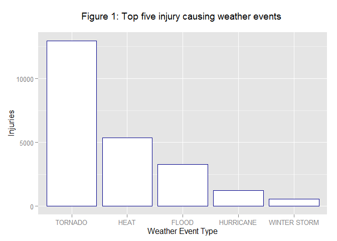
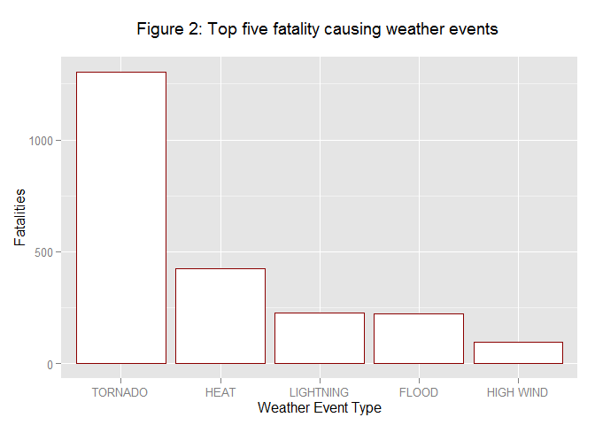
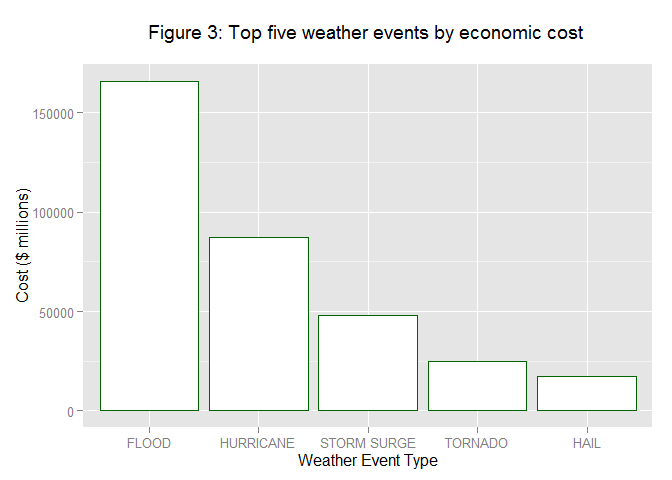

# Economic and Human Costs of Weather Events in US 1996 - 2011

###Synopsis

In this analysis, we investigate which types of weather events in the United
States are most harmful with respect to population health and which have the 
greatest economic consequences.

The data has two major issues which need to be rectified before further analysis
can be carried out. First, the data must be filtered to remove dates prior to 
1996 when only 3 events were being cataloged. Second, event types must be 
prepared such that duplicates can be removed later.

Fatalities and injuries must be investigated separately as a high count in one
doesn't necessarily correlate to a high count in the other. Each table has 
duplicates removed and the top five positions are filtered.

Crop and property damage values are held in two columns each, one containing a
damage amount and the other containing a multiplier, stored as a factor('b' for 
billion, 'm' for million, etc).

These character factors must be converted to numbers and multiplied by the 
damage amount before they can be summed together to create a dollar total column
for both crop and property damage.

Null rows are removed, duplicate rows are merged, the total column is divided by
one million (for tidier plotting) and the top five values are arranged in order. 

Bar charts are then created to display table information.

###Data Processing

1. Set working directory, load relevant packages and check that directory/files
exist before creating/downloading. 


```r
setwd("C:/Users/Dangermonger/Documents/GitHub")

library(plyr)
library(dplyr, warn.conflicts=FALSE) 
library(ggplot2)

##check that directory exists before creating

ifelse(!dir.exists(file.path("C:/Users/Dangermonger/Documents/GitHub", "./RepData_PeerAssessment2")), +
           dir.create(file.path("C:/Users/Dangermonger/Documents/GitHub", +
                                    "./RepData_PeerAssessment2")), FALSE)
```

```
## [1] FALSE
```

```r
setwd("C:/Users/Dangermonger/Documents/GitHub/Repdata_PeerAssessment2")

##check that files exists in directory before downloading. Use mode="wb" for pdf

if (!file.exists("StormData.csv.bz2")) { 
    fileUrl <- "https://d396qusza40orc.cloudfront.net/repdata%2Fdata%2FStormData.csv.bz2" 
    download.file(fileUrl, destfile = "./StormData.csv.bz2") ##download file
}

if (!file.exists("repdata-peer2_doc-pd01016005curr.pdf")) { 
    fileUrl <- "https://d396qusza40orc.cloudfront.net/repdata%2Fpeer2_doc%2Fpd01016005curr.pdf" 
    download.file(fileUrl, destfile = "./repdata-peer2_doc-pd01016005curr.pdf", mode="wb") 
}

if (!file.exists("FAQ.pdf")) { 
    fileUrl <- "https://d396qusza40orc.cloudfront.net/repdata%2Fpeer2_doc%2FNCDC%20Storm%20Events-FAQ%20Page.pdf" 
    download.file(fileUrl, destfile = "./FAQ.pdf", mode="wb") 
}
```

2. Storm data can be read directly and is converted to tbl and filtered to 
remove dates prior to 1996 when only 3 events were being cataloged. Columns of 
interest are selected, event types are converted to capital letters and a number
are approximately or exactly matched and replaced to create the tidy data that 
will be used in the remainder of the analysis.


```r
##read file directly (don't need to unzip)
stormdata <- read.csv("StormData.csv.bz2") 


##convert table to tbl, change date format, filter date, convert EVTYPE to
##capitals, select columns 
convertbl <- tbl_df(stormdata) %>% 
    mutate(BGN_DATE = as.Date(BGN_DATE, format = "%m/%d/%Y")) %>%
    filter(BGN_DATE >= "1996-01-01") %>%
    mutate(EVTYPE = toupper(as.character(EVTYPE))) %>% 
    select(EVTYPE, FATALITIES, INJURIES, PROPDMGEXP, PROPDMG, +
               CROPDMGEXP, CROPDMG)

##approximately or exactly match EVTYPE values

idx <- agrep(pattern = "FLOOD", convertbl$EVTYPE, max.distance = 1)
convertbl$EVTYPE[idx] <- "FLOOD"

idx <- agrep(pattern = "HAIL", convertbl$EVTYPE, max.distance = 1)
convertbl$EVTYPE[idx] <- "HAIL"

idx <- grep(pattern = "(STORM SURGE|STORM SURGE/TIDE)", convertbl$EVTYPE)
convertbl$EVTYPE[idx] <- "STORM SURGE"

idx <- grep(pattern = "(HURRICANE|TYPHOON)", convertbl$EVTYPE)
convertbl$EVTYPE[idx] <- "HURRICANE"

idx <- grep(pattern = "(HEAT|EXCESSIVE HEAT)", convertbl$EVTYPE)
convertbl$EVTYPE[idx] <- "HEAT"
```

3. Fatalities/injuries are investigated by selecting the event type, fatalities 
and injuries columns and removing rows where fatalities and injuries amount to 
zero. 


```r
harmtbl <- convertbl %>%
    select(EVTYPE, INJURIES, FATALITIES) %>%
    filter(FATALITIES & INJURIES > 0) ##remove rows where damage = 0
```

4. This data frame is then transformed twice to create top five tables for both 
injuries and fatalities with each data frame split by event type and a 
columnwise function applied to sum/remove duplicate values. Each table is 
selected by event type and fatalities or injuries, arranged in descending order 
and filtered by the top five positions.


```r
fatrem <-  harmtbl %>% 
    ddply("EVTYPE", numcolwise(sum)) %>% ##remove duplicates
    select(EVTYPE, FATALITIES) %>%
    arrange(desc(FATALITIES)) %>% ##order by fatalities
    top_n(5)
```

```
## Selecting by FATALITIES
```

```r
injrem <-  harmtbl %>% 
    ddply("EVTYPE", numcolwise(sum)) %>% ##remove duplicates
    select(EVTYPE, INJURIES) %>%
    arrange(desc(INJURIES)) %>% ##order by injuries
    top_n(5)
```

```
## Selecting by INJURIES
```

5. To sum crop and property damage it is first necessary to convert a factor 
column containing number abbreviations ('b' for billion, 'm' for million, etc) 
to exponent values. 


```r
unique(convertbl$PROPDMGEXP) ##find unique cost values for property damage
```

```
## [1] K   M B 0
## Levels:  - ? + 0 1 2 3 4 5 6 7 8 B h H K m M
```

```r
unique(convertbl$CROPDMGEXP) ##find unique cost values for crop damage
```

```
## [1] K   M B
## Levels:  ? 0 2 B k K m M
```

```r
##substitute characters for numerical values

convertbl$PROPDMGEXP <- gsub("B", 10^9, convertbl$PROPDMGEXP)
convertbl$PROPDMGEXP <- gsub("M", 10^6, convertbl$PROPDMGEXP)
convertbl$PROPDMGEXP <- gsub("m", 10^6, convertbl$PROPDMGEXP)
convertbl$PROPDMGEXP <- gsub("K", 10^3, convertbl$PROPDMGEXP)
convertbl$PROPDMGEXP <- gsub("H", 10^2, convertbl$PROPDMGEXP)
convertbl$PROPDMGEXP <- gsub("h", 10^2, convertbl$PROPDMGEXP)

convertbl$CROPDMGEXP <- gsub("B", 10^9, convertbl$CROPDMGEXP)
convertbl$CROPDMGEXP <- gsub("m", 10^6, convertbl$CROPDMGEXP)
convertbl$CROPDMGEXP <- gsub("M", 10^6, convertbl$CROPDMGEXP)
convertbl$CROPDMGEXP <- gsub("k", 10^3, convertbl$CROPDMGEXP)
convertbl$CROPDMGEXP <- gsub("K", 10^3, convertbl$CROPDMGEXP)
```

6. A table is then created where the exponent column for both crops and property
is multiplied by the damage column and a combined DamageTotal column is created 
containing the row sums of the multiplied columns. The relevant columns are 
selected and null rows are removed. 


```r
##Multiply PROPDMG by PROPDMGEX and CROPDMG by CROPDMGEX before summing. Remove
##null rows.

multbl <- convertbl %>%
    mutate(PropDamageTotal = PROPDMG * as.numeric(PROPDMGEXP)) %>% 
    mutate(CropDamageTotal = CROPDMG * as.numeric(CROPDMGEXP)) %>% 
    mutate(DamageTotal = rowSums(.[8:9], na.rm = TRUE)) %>%
    select(EVTYPE, DamageTotal) %>%
    filter(DamageTotal > 0) ##remove rows where damage = 0
```

7. Duplicate rows are merged, the total column is divided by one million and the
top five values are arranged in order. 


```r
duprem <-  multbl %>% 
    ddply("EVTYPE", numcolwise(sum)) %>% ##remove duplicates
    mutate(DamageTotal = DamageTotal/10^6) %>%
    arrange(desc(DamageTotal)) %>% ##order by damage amount
    top_n(5)
```

```
## Selecting by DamageTotal
```

###Results

####1. Across the United States, which types of events (as indicated in the EVTYPE variable) are most harmful with respect to population health?


```r
ggplot(data=injrem, 
       aes(x = reorder(EVTYPE, -INJURIES), y = INJURIES)) + 
    labs(title="Figure 1: Top five injury causing weather events \n") +
    labs(x="Weather Event Type", y="Injuries") + 
    geom_bar(binwidth=1, fill="white", colour="darkblue", stat = "identity")
```

 


```r
ggplot(data=fatrem, 
    aes(x = reorder(EVTYPE, -FATALITIES), y = FATALITIES)) + 
    labs(title="Figure 2: Top five fatality causing weather events \n") +
    labs(x="Weather Event Type", y="Fatalities") + 
    geom_bar(binwidth=1, fill="white", colour="darkred", stat = "identity")
```

 

####2. Across the United States, which types of events have the greatest economic consequences?


```r
ggplot(data=duprem, 
    aes(x = reorder(EVTYPE, -DamageTotal), y = DamageTotal)) + 
    labs(title="Figure 3: Top five weather events by economic cost \n") +
    labs(x="Weather Event Type", y="Cost ($ millions)") + 
    geom_bar(binwidth=1, fill="white", colour="darkgreen", stat = "identity")
```

 

